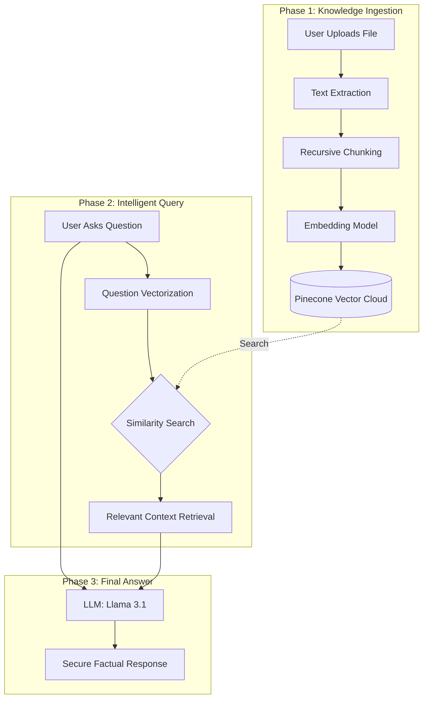

# 📚 RAG Bot: Comprehensive Documentation

Welcome to the **RAG Bot** documentation. This guide is designed to be your "easy-to-learn" manual, explaining everything from the core philosophy to the high-level architecture.

---

## 🌟 1. What is RAG Bot?

**RAG Bot** is an AI-powered document intelligence platform.

Imagine you have a 500-page PDF manual or a complex business report. Instead of reading it linearly or using generic search tools that just look for keywords, you can "talk" to your document.

### The Problem

Traditional search is like looking through a library's index card—you find the book, but you still have to read it.

### The Solution: RAG Bot

RAG Bot is like having a genius librarian who has already read every page. You ask a question, and the librarian finds the exact paragraphs, understands the context, and gives you a clear, concise answer.

---

## 🛠️ 2. The Tech Stack

We use a "Best-of-Breed" stack to ensure the bot is fast, secure, and accurate.

| Component         | Technology               | Why we chose it?                                                    |
| :---------------- | :----------------------- | :------------------------------------------------------------------ |
| **Frontend**      | **React 19 + Vite**      | Blazing fast UI with modern features and premium aesthetics.        |
| **Backend**       | **FastAPI (Python)**     | High-performance, asynchronous API framework.                       |
| **AI Brain**      | **Llama 3.1 (via Groq)** | Industry-leading LLM optimized for speed (sub-second inference).    |
| **Vector DB**     | **Pinecone**             | Cloud-native vector search for lightning-fast context retrieval.    |
| **Database**      | **MongoDB**              | Industry-standard NoSQL database for flexible user data management. |
| **Embeddings**    | **HuggingFace MiniLM**   | Converts text into mathematical "vectors" with high accuracy.       |
| **Orchestration** | **LangChain**            | The standard "glue" for building AI-powered applications.           |
| **Security**      | **JWT + bcrypt**         | Industry-standard authentication and password hashing.              |

---

## 🧠 3. How It Works (The "Magic")

RAG stands for **Retrieval-Augmented Generation**. Here is the 3-step magic trick that happens behind the scenes:

### Step 1: Ingestion (Teaching the Bot)

When you upload a document:

1.  The text is **extracted** (PDF, Docx, or Text).
2.  The text is **chunked** into small, meaningful pieces.
3.  Each piece is **vectorized** (turned into a list of numbers representing its "meaning").
4.  The vectors are stored in **Pinecone**, tagged with your unique `user_id`.

### Step 2: Retrieval (Finding the Facts)

When you ask a question:

1.  Your question is also turned into a **vector**.
2.  The system searches Pinecone for the **Top 5 most similar** text chunks.
3.  It filters these chunks to ensure they belong specifically to **you**.

### Step 3: Generation (Crafting the Answer)

1.  The system feeds the **Question** + the **Found Facts** to the Llama 3.1 AI.
2.  The AI is instructed: _"Answer using ONLY these facts."_
3.  The result is a factual, hallucination-free answer!

---

## 🌊 4. The Data Overflow (Visual Logic)

---

## 🚀 5. Why is RAG Bot Helpful?

- **🕒 Save Hours of Work**: Stop searching through folders. Get answers instantly.
- **🎯 100% Accuracy**: Because the AI is grounded in _your_ documents, it avoids "hallucinations" common in standalone AI.
- **🔒 Privacy First**: Your data is isolated at the database level. User A can never access User B's knowledge.
- **⚡ One-Click Deployment**: With our `setup.bat` and `run.bat` scripts, you're up and running in minutes.

---

## 📈 6. Project Roadmap

1. [x] **Core RAG Engine**: Working with PDF/Docx.
2. [x] **JWT Auth**: Secure user sessions.
3. [x] **Premium UI**: Modern, dark-themed interface.
4. [ ] **Multi-Vector Retrieval**: Support for images and tables (Upcoming).
5. [ ] **Mobile App**: Direct access via React Native (Upcoming).

---

### Still have questions?

Check the [API Reference](docs/api_reference.md) or the [Security Guide](docs/security.md).

**Built for the future of knowledge management.**

