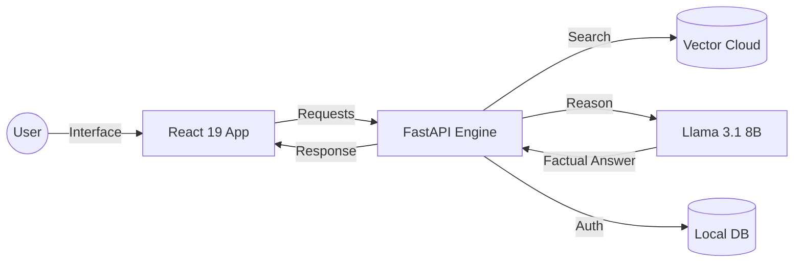

<div align="center">

# 🤖 RAG Bot: The Ultimate AI Document Assistant

### _Experience the future of Retrieval-Augmented Generation._


[](https://python.org)
[](https://react.dev)
[](https://fastapi.tiangolo.com)
[](https://pinecone.io)
[](https://groq.com)

---

**RAG Bot** is a sleek, professional-grade platform that turns your static documents into interactive knowledge. Stop searching, start conversing.

[**📖 Easy-to-Learn Documentation**](DOCUMENTATION.md) | [**⚡ Quick Setup**](#-one-click-setup) | [**🧠 How It Works**](DOCUMENTATION.md#-how-it-works-the-magic) | [**🛡️ Privacy Policy**](docs/security.md)

</div>

---

## 🚀 Why RAG Bot?

- **🕒 Instant Insight**: Get answers from 1,000+ pages of PDF in milliseconds.
- **🎯 Precise Context**: AI that uses _your_ facts, not just generic training data.
- **🛡️ Data Vault**: Absolute user-level data isolation for enterprise-grade privacy.
- **🎨 Premium UI**: A modern, dark-themed experience with fluid animations.

---

## 🧩 The Core Technology Stack

We've selected the best tools in the industry to build a robust, production-ready system:

- **Frontend**: React 19 (Hooks & Context) + Vite + Custom CSS Variables.
- **Backend**: FastAPI (Python) + LangChain Orchestration.
- **Database**: SQLite (User Accounts) + Pinecone (Vector Store).
- **Intelligence**: Meta Llama 3.1 via Groq (Sub-second processing).
- **Embeddings**: HuggingFace Local Models (No data leakage to external embedding APIs).

---

## ⚡ One-Click Setup (Windows)

I've engineered the setup to be as simple as possible. No terminal magic required.

### 1️⃣ Prepare Environment

Open `backend/.env` and enter your API keys:

- `GROQ_API_KEY`: [Get it here](https://console.groq.com)
- `PINECONE_API_KEY`: [Get it here](https://app.pinecone.io)

### 2️⃣ The "Power-Up" Scripts

| Command            | Description                                                 |
| :----------------- | :---------------------------------------------------------- |
| 🛠️ **`setup.bat`** | Double-Click to install all dependencies (Python & NodeJS). |
| 🚀 **`run.bat`**   | Double-Click to launch both servers simultaneously!         |

---

## 🧠 High-Level Architecture (The "Overflow")



---

## 📂 Project Structure

```text
📦 rag_bot
 ┣ 📂 backend           # FastAPI + LangChain Logic
 ┣ 📂 frontend          # React 19 + Vite Interface
 ┣ 📂 docs              # Engineering & Security Specs
 ┣ 📜 DOCUMENTATION.md  # 📘 Easy-to-Learn Master Guide
 ┣ 📜 setup.bat         # Automated Installer
 ┗ 📜 run.bat           # Launch All-in-One
```

---

<div align="center">

### Ready to transform your knowledge?

[Start Now](setup.bat)

Built with ❤️ by the RAG Bot Team

</div>
